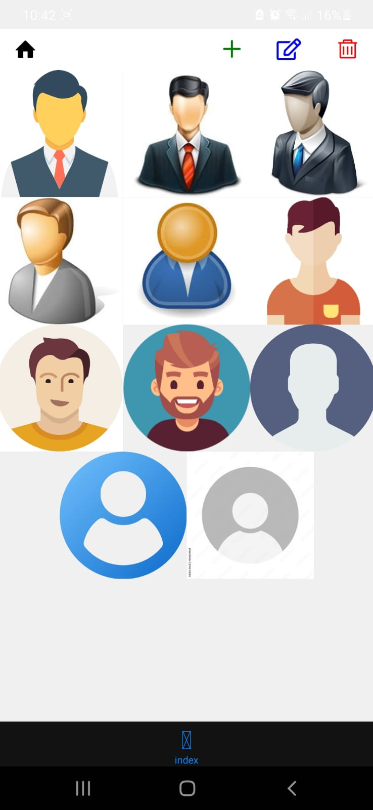

# Grandparents App (english, spanish)

## Get started 👋
1. Install dependencies
```bash
npm install
```

2. Start the app
```bash
npx expo start
```

## How to use it 
- Press the "plus" button, and add and image and the phone number you want to link to that photo (contact) and press the "SAVE" button
- Go back to home with the "home" button on the top and you'll be redirected to the home page where you'll see that contact you've just created
- You can edit them with the blue "EDIT" button on the top or delete them with the "DELETE" red button also on the top
- If you press the "EDIT" or "DELETE" button and you used it, you have to press it again to continue using the app normally
- That's it, thanks for watching, helping (code) or downloading for your grandparents and enjoy it 

Things you can do once you download the app
- Add images and their linked phone (contact)
- Edit them
- Delet them

## Problems or things to be fixed
- In the index.tsx, there's like an under navigation bar i didn't know how to take off
- Once you edit or delete a contact, you don't have to press the edit or delete button again to continue using the app



